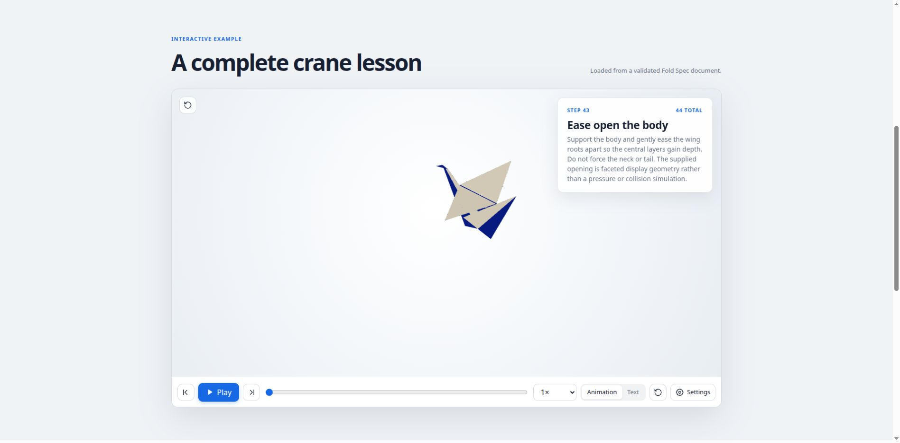

# Fold Spec

**A portable format for origami construction, instruction, animation, and accessible reading.**

`fold-spec` separates what a fold **means**, how paper **moves**, what a person **does**, and how the completed model is **presented**. A single document can support text-only lessons, named geometric constructions, deterministic 3D playback, tactile guidance, printable diagrams, and optional artistic scenes.

**Current specification:** `1.0.0-draft.1` · **Release channel:** beta · **Status:** implementer draft · **License:** MIT

[](https://foldlab.github.io/fold-viewer/)

**See the format in motion.** The companion
[Fold Viewer](https://github.com/FoldLab/fold-viewer) React package renders the
same checked-in crane document shown above. Try the
[live interactive demo](https://foldlab.github.io/fold-viewer/) or review the
viewer repository's explicit capability limits before integrating it.

This is a specification repository with runnable reference utilities and conformance examples—not an origami application or a fully general paper-physics engine. It defines a new document contract. Existing FoldLab 0.8 readers do not understand it without an adapter. See [migration](docs/migration.md) and [implementation coverage](IMPLEMENTATION-STATUS.md).

## Start here

| Your goal | Read or run |
|---|---|
| Understand the format | [Specification index](SPEC.md) and [architecture](docs/architecture.md) |
| Validate or package a file | [Quick start](docs/quickstart.md) |
| Author with named points and alignment constraints | [Authoring guide](docs/authoring-guide.md) and [Fold Source grammar](grammar/fold-source.ebnf) |
| Write accessible, text-only instructions | [Text and accessibility guide](docs/text-only-and-accessibility.md) |
| Implement a player or importer | [Player guide](docs/implementing-a-player.md) and [structural field reference](docs/field-reference.md) |
| Embed the reference crane in React | [Fold Viewer](https://github.com/FoldLab/fold-viewer) and its [live demo](https://foldlab.github.io/fold-viewer/) |
| Explore a complete example | [Paper crane](examples/crane/README.md): 44 teaching steps and a resolved geometric demonstration |
| Evaluate exactly what is tested | [Verification](VERIFICATION.md) and [conformance corpus](conformance/README.md) |

## Three complementary representations

```text
.foldsrc                     .fold.json                       .foldlab
readable authoring source  →  structured document + assets  →  portable ZIP package
          named intent         instructions / resolved motion      declared payload hashes
```

The authoring parser produces JSON data; it is **not** a complete symbolic-to-animation compiler. Resolved operations allow a player to replay a model without guessing geometric solutions or running an authoring solver every frame.

The suffix `.fold` is reserved for the existing FOLD geometry interchange ecosystem; this repository does not redefine it. `.foldlib.json` carries reusable data-only construction parts. `.foldscene` carries a reusable scene with explicitly declared sibling assets. Schema identifiers under `fold-spec.example` are reserved documentation identifiers, not a deployed service.

## Quick start

Python **3.10 or newer** is required. No Node.js, browser, service key, or online API is needed to use the installed tools.

```sh
python -m venv .venv
. .venv/bin/activate
python -m pip install -r requirements.txt
python tools/check.py
```

In PowerShell, activate with `.venv\Scripts\Activate.ps1` instead. Package installation needs access to the Python package registry; validation afterward uses bundled schemas and never fetches a document's URLs.

Validate the crane, inspect its packaged counterpart, and export descriptive text:

```sh
python tools/foldspec.py validate examples/crane/crane.fold.json
python tools/foldspec.py inspect examples/crane/crane.foldlab
python tools/foldspec.py text examples/crane/crane.fold.json --descriptive -o build/crane.txt
python tools/foldspec.py text examples/crane/crane.fold.json --descriptive --html -o build/crane.html
```

Parse the named-geometry example, sample a real operation, and create a new portable package:

```sh
python tools/foldspec.py parse-source examples/authoring/named-fold.foldsrc -o build/named-fold.fold.json
python tools/foldspec.py sample examples/crane/crane.fold.json --operation op-12 --progress 0.55 -o build/crane-base-state.json
python tools/foldspec.py pack examples/crane/crane.fold.json -o build/crane.foldlab
```

`pack` refuses to overwrite an existing destination. Choose a new filename when repeating that command. `sample` emits vertices and triangle indices, not a rendered image. `parse-source` resolves syntax and typed references, not every fold constraint into 3D motion.

Build an offline documentation site:

```sh
python tools/build_site.py
python tools/check_site.py build/site
```

Open `build/site/index.html` locally. The supplied `site/index.html` is a prebuilt copy of these documentation pages. It contains no analytics, external fonts, or required scripts.

## What a document contains

| Layer | Contents |
|---|---|
| Identity and paper | Stable IDs, revision, localized metadata, rectangular sheets, physical dimensions, two-sided materials, textures, and provenance |
| Authoring intent | Named points/lines/regions, geometric alignments, explicit solution witnesses, and version-pinned reusable parts |
| Resolved motion | Directed hinges, whole-sheet handling, shared-vertex sampled operations, tolerances, layer relations, and persistent creases |
| Instruction | Ordered steps, groups, operation ranges, independent waits, captions, camera views, and source-step mappings |
| Accessibility | Shared primary copy, orientation, tactile locating/checking/recovery, language fallback, review evidence, and optional narration references |
| Presentation and output | Physical finishing steps, a static final pose, optional tip/bow/flutter, scenes, print panels, and actual-size paper templates |

Examples deliberately distinguish `planned`, `instructions`, `partial`, and `resolved` content. A metadata entry is not an imported lesson; a text lesson is not an animated model; a stored motion is not a physical-foldability certificate.

## Repository layout

```text
fold-spec/
├── README.md                 Entry point and tested commands
├── SPEC.md                   Normative chapter index
├── spec/                     21 normative chapters
├── schemas/                  Versioned JSON Schemas
├── grammar/                  Fold Source EBNF and mapping notes
├── examples/                 Text, geometry, authoring, crane, scene, and library examples
├── conformance/              Language-neutral valid/invalid fixtures
├── tools/                    Validator, packer, sampler, parser, text export, docs builder
├── tests/                    Executable regression and mathematical tests
├── docs/                     Guides, field reference, migration, glossary, design records
├── site/                     Prebuilt offline documentation
└── .github/                  CI, issue forms, and pull-request guidance
```

## Crane example: what it proves

The [crane directory](examples/crane/README.md) includes a geometric demonstration with **40 ordered operations and 44 instructional steps**, a text-only counterpart, a readable authoring study, a portable archive, and plain-text/HTML/Markdown instructions. The square-base collapse has four physical ranges and a separate checkpoint, not four disconnected pieces of paper.

The compound paths maintain shared material vertices and are checked for interpolation strain. Neck/tail/head paths and the body opening remain faceted geometric approximations. No collision-free motion, real-paper usability, screen-reader certification, or photorealistic rendering is claimed. The complete text alternative makes those limitations visible too.

## Conformance, not guesswork

Normative prose defines interpretation. JSON Schema checks structure. Semantic and geometric checks cover additional constraints. The [coverage table](IMPLEMENTATION-STATUS.md) names what the reference implementation does and does not check, including its limited planar solver. A successful validation report is never presented as a blanket "physically correct origami" result.

Read [CONTRIBUTING.md](CONTRIBUTING.md) before changing normative meaning or schemas. Report contradictions through the issue templates. Release criteria are in [RELEASE-CHECKLIST.md](RELEASE-CHECKLIST.md); design decisions are tracked in [docs/decisions.md](docs/decisions.md).
